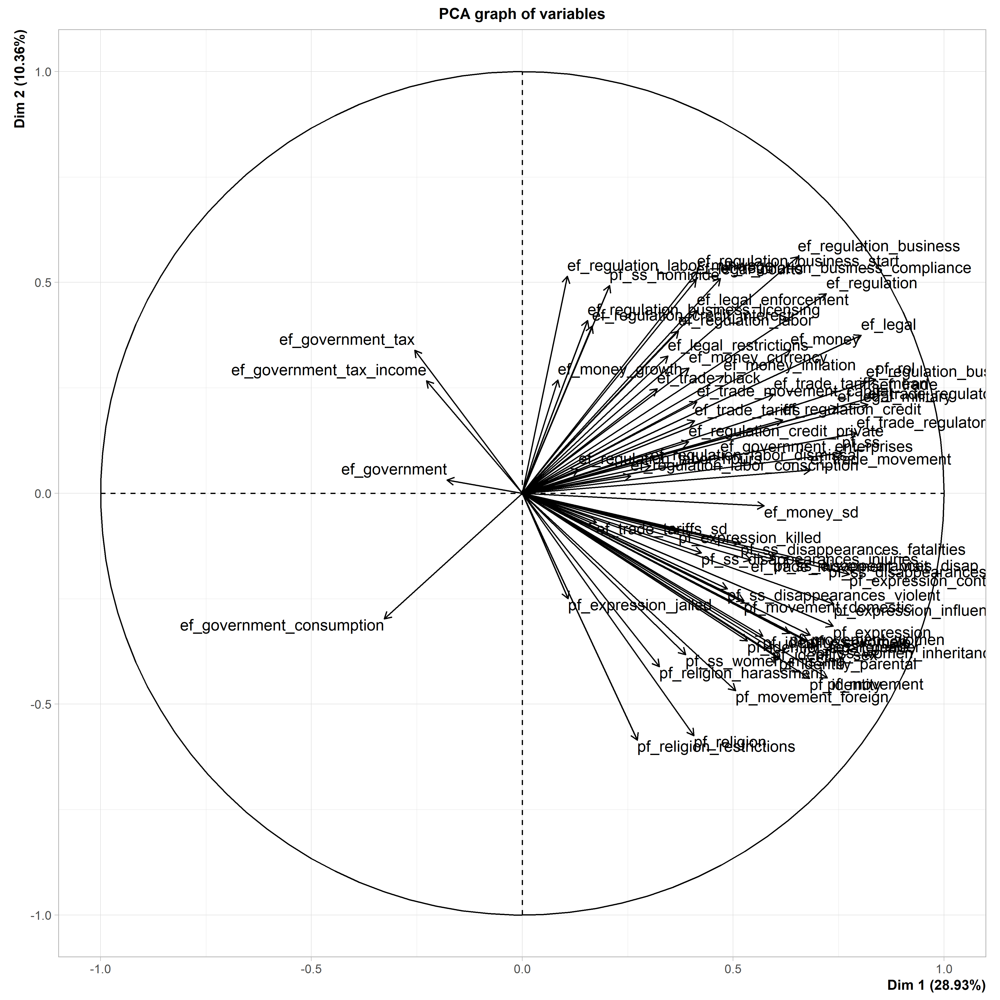

Digital Strategies for Social Science Research - Assignment 2
================
Nicoleta Bobescu

## Introduction

What is freedom? It is a question that has echoed through the realms of
philosophy, politics, and human consciousness for centuries. Freedom is
more than just a word, it is a concept that shapes societies, defines
individual aspirations, and serves as the cornerstone of human progress.
For instance, the national ethos of the United States is the widely
known “American Dream”—a compelling narrative that encapsulates the
belief in individual freedom and the limitless possibilities that await
each citizen. This dream, with its roots reaching back to the nation’s
founding principles, has fueled the aspirations of countless individuals
who seek prosperity.

Yet, the concept of freedom is not confined to the borders of any single
nation. It transcends geographical boundaries and cultural nuances,
manifesting in diverse forms across the globe. Whether expressed through
the struggle for civil rights, the pursuit of economic liberties, or the
quest for political autonomy, the essence of freedom remains a universal
truth that resonates in the hearts of people worldwide.

How does one quantify freedom? Without an objective measure, it is
difficult to determine whether a specific action contributes to an
increase or decrease in freedom, imparts stability or instability to
freedom, or whether freedom itself yields superior outcomes (McMahon and
Dowd, 2014). Thankfully, such a tool is already available—the Human
Freedom Index (HFI). Developed collaboratively by the Fraser Institute
in Canada, the Liberales Institut in Germany, and the Cato Institute in
the United States, the HFI project aims to establish a comprehensive and
objective measure of freedom.

The present assignment will analyze the HFI data using statistical
methods in an attempt to bridge the gap between abstract concepts and
concrete measurements. Specifically, I will be using PCA and t-SNE to
help uncover hidden structures, visualize trends, and provide actionable
insights, facilitating the identification of opportunities for
improvement and policy refinement.

## Data description and preparation

The data comes from the HFI for the year 2016, containing insights from
162 countries and 112 distinct indicators of personal and economic
freedom in many different areas such as rule of law, religion,
relationships, and freedom to trade internationally, among others. The
index is presented on a scale from 0 to 10, with higher scores
indicating higher levels of freedom. It is important to note that the
specific rankings and scores for individual countries can vary each
year, and the index is updated annually to reflect changes in the
relevant data. The 2016 version can be accessed at
<https://www.cato.org/human-freedom-index/2016>, and the archives at
<https://www.cato.org/search/category/human-freedom-index>.

The data contains variables with a large proportion of missing data. For
example, “pf_identity_legal” (legal gender) is missing ~86% of its data,
and this needs to be resolved before any statistical analysis can
proceed. The first step in handling missing data involved eliminating
columns (variables) with more than 10% missing values, as missing data
exceeding this threshold can introduce bias in statistical analyses
(Bennett, 2001). This resulted in 44 variables being removed, 15 of them
pertaining to personal freedom, and 29 to economic freedom. Then, any
missing values in the remaining variables were imputed using the mean
for each variable. Lastly, data was filtered to only contain the most
recent observations, those for the year 2016. After all data
manipulation, the data set was left with 68 active variables.

``` r
# Clearing work space
rm(list = ls())
graphics.off()

# Loading packages
library(FactoMineR)
library(explor)
library(ggplot2)
library(Rtsne)
library(dplyr)
library(ggrepel)

# Loading data
hfi <- read.csv("hfi2008_2016.csv")

# Inspecting data
str(hfi, list.len=10)
```

    ## 'data.frame':    1458 obs. of  123 variables:
    ##  $ year                              : int  2016 2016 2016 2016 2016 2016 2016 2016 2016 2016 ...
    ##  $ ISO_code                          : chr  "ALB" "DZA" "AGO" "ARG" ...
    ##  $ countries                         : chr  "Albania" "Algeria" "Angola" "Argentina" ...
    ##  $ region                            : chr  "Eastern Europe" "Middle East & North Africa" "Sub-Saharan Africa" "Latin America & the Caribbean" ...
    ##  $ pf_rol_procedural                 : num  6.66 NA NA 7.1 NA ...
    ##  $ pf_rol_civil                      : num  4.55 NA NA 5.79 NA ...
    ##  $ pf_rol_criminal                   : num  4.67 NA NA 4.34 NA ...
    ##  $ pf_rol                            : num  5.29 3.82 3.45 5.74 5 ...
    ##  $ pf_ss_homicide                    : num  8.92 9.46 8.06 7.62 8.81 ...
    ##  $ pf_ss_disappearances_disap        : int  10 10 5 10 10 10 10 10 10 10 ...
    ##   [list output truncated]

``` r
length(unique(hfi$region)) # 10 different regions
```

    ## [1] 10

``` r
length(unique(hfi$countries)) # 162 different countries
```

    ## [1] 162

``` r
# Setting seed for replication
set.seed(12345)

# Removing scientific notation
options(scipen = 999) 
```

``` r
# Data manipulation
# All variables are on the same scale of 0 to 10, scaling is not necessary

# Checking for missing data
missing_percentages <- colMeans(is.na(hfi)) * 100 # some columns have very high percentage of missing data
# For example, pf_identity_legal has 86% missing data

# Identifying columns with more than 10% missing values and removing them
columns_to_remove <- names(hfi)[colMeans(is.na(hfi)) > 0.1] # identifying
hfi <- hfi[, !(names(hfi) %in% columns_to_remove)] # removing

# Imputing missing values with the mean for each variable and filtering by newest available data
hfi_imputed <- hfi |> 
  mutate_all(~ifelse(is.na(.), mean(., na.rm = TRUE), .)) |> 
  filter(year == 2016)

# Sub-setting data set to only include active variables
hfi_active <- hfi_imputed[, c(5:32, 35:74)] # both personal freedom and economic freedom variables

str(hfi_active, list.len=10) # checking
```

    ## 'data.frame':    162 obs. of  68 variables:
    ##  $ pf_rol                            : num  5.29 3.82 3.45 5.74 5 ...
    ##  $ pf_ss_homicide                    : num  8.92 9.46 8.06 7.62 8.81 ...
    ##  $ pf_ss_disappearances_disap        : num  10 10 5 10 10 10 10 10 10 10 ...
    ##  $ pf_ss_disappearances_violent      : num  10 9.29 10 10 10 ...
    ##  $ pf_ss_disappearances_fatalities   : num  10 9.93 10 10 9.32 ...
    ##  $ pf_ss_disappearances_injuries     : num  10 9.99 10 9.99 9.93 ...
    ##  $ pf_ss_disappearances              : num  10 8.84 8.5 9.5 9.35 ...
    ##  $ pf_ss_women_missing               : num  7.5 7.5 10 10 5 ...
    ##  $ pf_ss_women_inheritance           : num  5 0 5 10 10 ...
    ##  $ pf_ss_women                       : num  7.5 5.83 8.33 10 8.33 ...
    ##   [list output truncated]

## Principal Component Analysis (PCA)

### Why PCA?

The HFI data contains dozens of variables representing different aspects
of human freedom, further split between personal and economic freedom.
PCA is a good choice here for three main reasons: 1) dimensionality
reduction, PCA can reduce the dimensionality of the data while retaining
as much of the original variability as possible, which helps identify
the most important components within; 2) correlation exploration: PCA
can reveal underlying patterns and relationships between variables; and
3) visualization: PCA facilitates the visualization of complex data by
reducing is dimensionality, making it easier to plot and understand the
overall structure and the relationships within the data.

``` r
# PCA 1
res1 <- PCA(hfi_active, graph = F) # all variables
res1
```

    ## **Results for the Principal Component Analysis (PCA)**
    ## The analysis was performed on 162 individuals, described by 68 variables
    ## *The results are available in the following objects:
    ## 
    ##    name               description                          
    ## 1  "$eig"             "eigenvalues"                        
    ## 2  "$var"             "results for the variables"          
    ## 3  "$var$coord"       "coord. for the variables"           
    ## 4  "$var$cor"         "correlations variables - dimensions"
    ## 5  "$var$cos2"        "cos2 for the variables"             
    ## 6  "$var$contrib"     "contributions of the variables"     
    ## 7  "$ind"             "results for the individuals"        
    ## 8  "$ind$coord"       "coord. for the individuals"         
    ## 9  "$ind$cos2"        "cos2 for the individuals"           
    ## 10 "$ind$contrib"     "contributions of the individuals"   
    ## 11 "$call"            "summary statistics"                 
    ## 12 "$call$centre"     "mean of the variables"              
    ## 13 "$call$ecart.type" "standard error of the variables"    
    ## 14 "$call$row.w"      "weights for the individuals"        
    ## 15 "$call$col.w"      "weights for the variables"

### Graphs

``` r
# Plotting PCA results: variables graph
plot(res1, choix = "var")
```

<!-- -->

The PCA graph of variables shows the contribution of each variable to
the principal components (henceforth PC). PCs can be though of as new
variables that result from the transformation of the original variables
through PCA. Each original variable is represented as a vector in the
plot, and the length and direction of the vector indicate the variable’s
contribution to the corresponding PC. Thus, longer vectors represent
variables that contribute more to the PC, while shorter vectors have
less influence. Their direction shows the relationship between variables
and PCs: variables pointing in the same direction are positively
correlated, while those pointing in opposite directions are negatively
correlated.

``` r
# Plotting PCA results: individuals graph
plot(res1, choix = "ind")
```

<!-- -->

The PCA graph of individuals shows where each individual observation is
represented in the PC space. This plot helps visualize the relationship
and (dis)similarities between observations. The position of each point
in the plot is determined by its scores on the PCs. Points that are
close to each other are similar in terms of personal and economic
freedom. The distance of a point from the origin indicates the overall
contribution of the individual to the PCs. Thus, points that are farther
from the origin contribute more to the variability in the data, while
points that are closer to the origin contribute less. Here, clusters in
the plot may indicate groups of similar observations, found through
underlying patterns in the data.

### Eigenvalues

The cumulative percentage of variance explained (PVE) plot below
provides a visual aid for deciding how many PCs to retain in the
analysis. It helps visualize the proportion of total variability in a
data set that is accounted for by each successive PC. It is most
commonly used to find an “elbow”, or the point at which adding more
components provides diminishing returns in terms of explaining the
variance. In this case, there is no clear or sharp elbow, so we can
inspect the numbers instead. Looking at the eigenvalues, we can see that
1 PC explains ~29% of the variance, 2 PCs explain ~39% of the variance,
and 3 PCs explain ~45% of the variance. In this case, choosing to retain
the first 3 PCs is appropriate, although still not ideal—as most of the
variance still remains unexplained.

``` r
# Plotting the cumulative PVE and inspecting eigenvalues
plot(res1$eig[, 3], type="o", main = "Cumulative percentage of variance explained") 
```


``` r
head(res1$eig, 10)
```

    ##         eigenvalue percentage of variance cumulative percentage of variance
    ## comp 1   19.671864              28.929211                          28.92921
    ## comp 2    7.044900              10.360146                          39.28936
    ## comp 3    3.819104               5.616329                          44.90569
    ## comp 4    3.361078               4.942762                          49.84845
    ## comp 5    3.139409               4.616778                          54.46523
    ## comp 6    2.951536               4.340494                          58.80572
    ## comp 7    2.196101               3.229560                          62.03528
    ## comp 8    1.950737               2.868731                          64.90401
    ## comp 9    1.583845               2.329184                          67.23320
    ## comp 10   1.542350               2.268161                          69.50136

### Contributions of each variable

``` r
# Inspecting contributions of each variable
head(res1$var$contrib, 10)
```

    ##                                     Dim.1     Dim.2      Dim.3      Dim.4
    ## pf_rol                          3.5668266 1.0383103 0.98891888 1.09298337
    ## pf_ss_homicide                  0.2178940 3.4476945 0.18660771 2.31821915
    ## pf_ss_disappearances_disap      1.8100728 0.3471415 0.09648686 0.83824701
    ## pf_ss_disappearances_violent    1.2004499 0.7290276 3.92584269 3.77612600
    ## pf_ss_disappearances_fatalities 1.3613880 0.1981455 4.30847043 4.75768201
    ## pf_ss_disappearances_injuries   0.9153108 0.2832090 5.53726972 5.42707324
    ## pf_ss_disappearances            2.6805664 0.4177842 2.87057708 3.53178299
    ## pf_ss_women_missing             0.7621263 2.0781632 0.95216191 0.01848746
    ## pf_ss_women_inheritance         2.4731377 1.8725532 0.40699763 2.08383619
    ## pf_ss_women                     2.3682184 1.6015683 0.88373047 1.56311053
    ##                                      Dim.5
    ## pf_rol                          0.02158787
    ## pf_ss_homicide                  1.21222503
    ## pf_ss_disappearances_disap      0.54360271
    ## pf_ss_disappearances_violent    2.80339878
    ## pf_ss_disappearances_fatalities 7.59621952
    ## pf_ss_disappearances_injuries   6.70219595
    ## pf_ss_disappearances            3.18511139
    ## pf_ss_women_missing             0.25252084
    ## pf_ss_women_inheritance         0.33904165
    ## pf_ss_women                     0.59943248

Each column (Dim.1, Dim.2, etc.) represents a PC, they are the axes that
capture the most variance in the data. Each row corresponds to a
variable in the data set. The values represent the contribution each
variable has to each PC. The higher the value, the more it contributes
to that particular PC. This is where the particularities of each PC
become more salient, and we can identify what they measure.

Looking at the first PC, Dim.1, the variables “ef_trade” (freedom to
trade internationally), “pf_rol” (rule of law), and
“ef_trade_regulatory” (regulatory trade barriers) have the highest
contributions (3.65247700, 3.56682655, and 3.41269230, respectively).
Thus, PC 1 seems to represent a broad measure of economic freedom with a
focus on international trade, regulatory trade barriers, and the rule of
law. It reflects the extent to which a country allows international
trade, the regulatory environment for trade, and the overall legal
framework supporting economic activities.

Looking at the second PC, Dim.2, the variables
“pf_religion_restrictions” (legal and regulatory restrictions),
“pf_religion” (religious freedom), and “ef_regulation_business”
(business regulation) have the highest contributions (4.86493603,
4.68374675, and 4.46304350, respectively). Thus, PC 2 seems to reflect
the interplay between legal and regulatory restrictions on religion,
religious freedom, and the regulatory environment for businesses. It
reflects the extent to which a country maintains control over religious
practices and sets the regulatory framework for businesses.

Looking at the third PC, Dim.3, the variables “ef_money_currency”
(freedom to own foreign currency bank account), “ef_trade_tariffs”
(tariffs), and “pf_expression_killed” (press killed) have the highest
contributions (7.691447277, 7.398099711, and 5.933321365, respectively).
Thus, PC 3 seems to provide a measure that reflects financial freedom,
trade tariffs, and the protection of freedom of expression. It reflects
the extent to which a country navigates economic openness, regulatory
policies in international trade, and the protection of freedom of
expression.

### Quality of representation of each variable

``` r
# Inspecting the quality of representation
head(res1$var$cos2, 10)
```

    ##                                      Dim.1      Dim.2       Dim.3        Dim.4
    ## pf_rol                          0.70166126 0.07314792 0.037767841 0.0367360257
    ## pf_ss_homicide                  0.04286381 0.24288661 0.007126743 0.0779171583
    ## pf_ss_disappearances_disap      0.35607505 0.02445577 0.003684934 0.0281741374
    ## pf_ss_disappearances_violent    0.23615086 0.05135926 0.149932017 0.1269185476
    ## pf_ss_disappearances_fatalities 0.26781039 0.01395915 0.164544969 0.1599094125
    ## pf_ss_disappearances_injuries   0.18005870 0.01995179 0.211474092 0.1824081751
    ## pf_ss_disappearances            0.52731738 0.02943248 0.109630326 0.1187059878
    ## pf_ss_women_missing             0.14992445 0.14640451 0.036364054 0.0006213779
    ## pf_ss_women_inheritance         0.48651227 0.13191949 0.015543663 0.0700393639
    ## pf_ss_women                     0.46587269 0.11282888 0.033750586 0.0525373672
    ##                                        Dim.5
    ## pf_rol                          0.0006777317
    ## pf_ss_homicide                  0.0380567058
    ## pf_ss_disappearances_disap      0.0170659143
    ## pf_ss_disappearances_violent    0.0880101632
    ## pf_ss_disappearances_fatalities 0.2384764253
    ## pf_ss_disappearances_injuries   0.2104093656
    ## pf_ss_disappearances            0.0999936845
    ## pf_ss_women_missing             0.0079276628
    ## pf_ss_women_inheritance         0.0106439052
    ## pf_ss_women                     0.0188186394

The squared cosine values (cos2) represent the quality of representation
of each variable on each PC. Their values range from 0 to 1, with values
closer to 1 indicating high quality of representation, and values closer
to 0 indicating poor representation. Thus, a variable with a higher
value is well-represented by the corresponding PC, whereas a variable
with a lower value does not contribute much to that PC.

- PC 1 has the variables with the best quality of representation. The
  variables “ef_trade” (freedom to trade internationally) and “pf_rol”
  (rule of law) have the highest cos2 values across all PCs (0.718510298
  and 0.701661258, respectively), indicating that they are highly
  representative of PC 1.
- PC 2 has “pf_religion_restrictions” (legal and regulatory
  restrictions) and “pf_religion” (religious freedom) as its top 2
  variables in terms of quality of representation (0.3427298562, and
  0.3299652531, respectively). Even though these are the highest values,
  they are rather low and poorly representative.
- PC 3 has “ef_money_currency” (freedom to own foreign currency bank
  account) and “ef_trade_tariffs” (tariffs) as its top 2 variables
  (0.2937443748 and 0.2825411260, respectively). Again, quite low and
  poorly representative.

### Results


Exploring the results through the variables plot and data, it seems that
Axis 1 (PC 1) is likely related to factors associated with economic
freedom, legal systems, rule of law, and perhaps expressions of control
and military influence. The high positive loadings for these variables
indicate that countries with higher scores on Axis 1 tend to have
greater freedom in the aforementioned dimensions. Axis 2 (PC 2) seems to
be associated with religious freedom, regulatory environments for
businesses, and aspects of legal and labor regulations. The strong
negative loadings for the religion-related variables indicate that
countries with higher scores on Axis 2 have more religious freedom.
Furthermore, the positive loadings for the regulation-related variables
indicate that countries that score higher on Axis 2 are those that
exhibit a regulatory environment more favorable to business operations.


We can go back to the PCA and add the available supplementary variables
“year”, “ISO_code”, “countries”, and “region”. These will serve the
purpose of providing additional information to the analysis. As they are
categorical variables, they will not be used in the calculation of PCs,
and are incorporated just to aid interpretation. Exploring the results
again through the variables plot, we can now see the relative position
of each country and region. For example, looking at Axis 1, North
America and Eastern Europe are on the far right, indicating they are
strongly associated with PC 1, or factors associated with more economic
freedom, legal systems, and rule of law. Conversely, Middle East and
North Africa are found on the left side, meaning they are strongly
associated with the opposite end of PC 1, meaning less economic freedom,
legal systems, and rule of law.


When looking at the individual countries, there is some overlap as the
data set contains 162 different countries, but interpretation is still
possible by zooming in or looking at the outliers. Let us keep looking
at PC 1: the far right of Axis 1 is represented by counties like New
Zealand, the Netherlands, and Denmark. All of them are countries that
are considered to be developed, and typically found at the top in
measures of economic power, legal systems, and social benefits.
Conversely, the far left is represented by countries like Syria, Iraq,
and Lybia. These nations are often characterized by lower levels of
economic development, challenges in legal systems, and political
turmoil. Their placement on the far left of Axis 1 indicates a strong
negative association with the characteristics captured by PC 1,
highlighting potential issues such as economic constraints, legal
challenges, and social disparities. Overall, the alignment of the
countries reinforces the association of PC 1 with factors related to
economic freedom, legal systems, and the rule of law.

### Discussion

This first PCA analysis explored the relationships and patterns that
emerge when considering the entire data set, with both personal and
economic freedom variables. This analysis was important because 1) it
was able to capture the overall variability in the data, 2) it helped
understand the overall structure of the data and identify patterns
across all variables, and 3) it considered the relationship between
personal and economic freedom.

However, there were some limitations. I would argue that the data set is
too large: the visualizations had notable overlap, the cumulative
percentage of variance explained was rather low even when considering 3
PCs (~45%), the contributions of each variable were relatively small and
sometimes odd (recall PC3 being associated with freedom to own foreign
currency, tariffs, and media killings), and the quality of
representation of each variable was low for anything outside of PC 1.
One possible explanation is that the variables are highly correlated, so
there are none that particularly stand out, but it might also suggest
that the data set is characterized by a high degree of complexity or
heterogeneity. The limited explanatory power of the first few PCs could
be due to the intricate interactions and dependencies among variables,
making it challenging to capture a substantial portion of the
variability with a small number of components.

## t-distributed stochastic neighbor embedding (t-SNE)

### Why SNE?

As mentioned before, the HFI data contains a multitude of variables
pertaining to different aspects of personal and economic freedom, and
t-SNE could be particularly effective in 1) capturing the complex
non-linear relationship between the variables, 2) reducing the
dimensionality of the data while retaining the essential structure, and
3) highlighting clusters within the data in order to reveal interesting
patterns.

``` r
# Converting from data frame to matrix to be able to use jitter()
hfi_active_matrix <- as.matrix(hfi_active)

# t-SNE
sne <- Rtsne(jitter(hfi_active_matrix)) # needs jitter because of duplicates

# Defining colors for each region (none of the ggplot2 presets convinced me)
region_colors <- c(
  "Eastern Europe" = "#3498db",
  "Middle East & North Africa" = "#222222",
  "Sub-Saharan Africa" = "#f39c12",
  "Latin America & the Caribbean" = "#2ecc71",
  "Caucasus & Central Asia" = "#ff5733",
  "Oceania" = "#9b59b6",
  "Western Europe" = "#009688",
  "South Asia" = "#e91e63",
  "North America" = "#00796b",
  "East Asia" = "#3f51b5")

# Please zoom in on all visualizations for best clarity and fewest overlaps!

# Coloring and labeling by region
ggplot(hfi_active_with_supp, aes(x = sne$Y[, 1], y = sne$Y[, 2], color = region, label = region)) +
  geom_point() +
  geom_text_repel(size = 3) +
  scale_color_manual(values = region_colors) +
  theme_minimal() +
  labs(title = "t-SNE Visualization of HFI 2016 data by region",
       x = "t-SNE Dimension 1",
       y = "t-SNE Dimension 2") +
  theme(legend.position = "none")
```

<!-- -->

``` r
# Somewhat difficult to discern the regions

# Coloring by region and labeling by country
ggplot(hfi_active_with_supp, aes(x = sne$Y[, 1], y = sne$Y[, 2], color = region, label = countries)) +
  geom_point() +
  geom_text_repel(size = 3) +
  scale_color_manual(values = region_colors) +
  theme_minimal() +
  labs(title = "t-SNE Visualization of HFI 2016 data by region and country",
       x = "t-SNE Dimension 1",
       y = "t-SNE Dimension 2") +
  theme(legend.position = "top")
```

<!-- -->

``` r
# Coloring by region and labeling by country with facets for each region
ggplot(hfi_active_with_supp, aes(x = sne$Y[, 1], y = sne$Y[, 2], color = region, label = countries)) +
  geom_point() +
  geom_text_repel(size = 3) +
  scale_color_manual(values = region_colors) +
  theme_minimal() +
  labs(title = "t-SNE Visualization of HFI 2016 data by region and country") +
  facet_wrap(~region, scales = "fixed") +
  theme(legend.position = "none",
        axis.title = element_blank(),
        axis.text = element_blank(),
        axis.ticks = element_blank(),
        axis.line = element_blank())
```

<!-- -->

``` r
# Now it's easier to discern every region's relative position
```

## Bibliography

Bennett, D.A., 2001. How can I deal with missing data in my study?.
*Australian and New Zealand journal of public health, 25*(5),
pp.464-469.

Kassambara, A., 2017. *Practical guide to principal component methods in
R: PCA, M (CA), FAMD, MFA, HCPC, factoextra* (Vol. 2). Sthda. Retrieved
from
<http://www.sthda.com/english/articles/31-principal-component-methods-in-r-practical-guide/112-pca-principal-component-analysis-essentials>.

McMahon, F. and Dowd, A., 2014. Human freedom: from pericles to
measurement. *The Independent Review, 19*(1), pp.65-84.

Vásquez, I. and Porčnik, T., 2016. *The Human Freedom Index 2016*.
