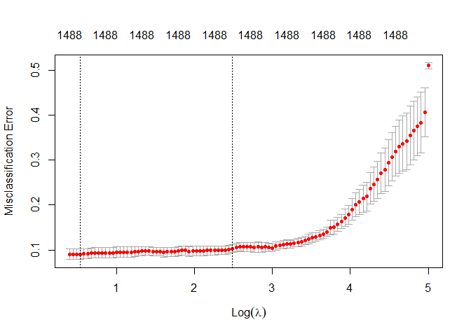
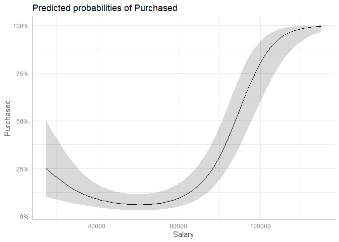
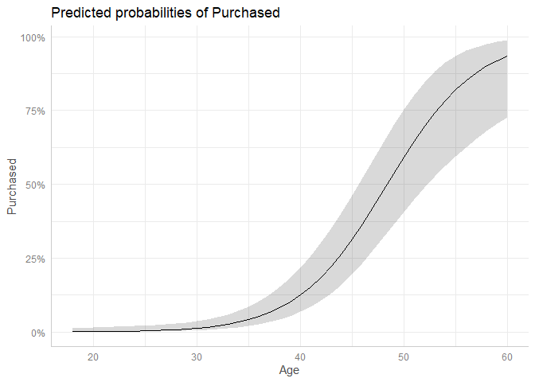

Machine Learning for Social Science - Lab 1
================
Nicoleta Bobescu

``` r
# Clearing work space
rm(list = ls())
graphics.off()

# Loading needed packages
library(data.table)
library(ggplot2)
library(mlbench)
library(caret)
library(ggeffects)
library(glmnet)
library(splines)
```

# Part 1: Bernie Sanders and Donald Trump tweets

## Standard logistic regression

- The data set is comprised of tweets from Donald Trump and Bernie
  Sanders. The objective is to explore how accurately we can predict who
  the author of a given tweet is based on its content, and to identify
  which words are the most discriminative. The tweets have been
  preprocessed & cleaned, and are stored in a document-term matrix
  format with rows indicating tweets, and columns indicating the
  frequency of words in different tweets.

``` r
# Loading dataset
twitter <- fread(file = 'trumpbernie.csv')

# Checking dataset
dim(twitter)
```

    ## [1] 1003 1496

``` r
# Removing columns with random Arabic characters
twitter <- twitter[, -1495]
twitter <- twitter[, -1494]
```

- The data has 1003 rows and 1496 columns. Minus two columns from
  removing those with random Arabic characters.
- Data sets with a large number of variables relative to the number of
  rows are considered high dimensional, therefore I characterize this
  data set as being high-dimensional.
- Standard linear models cannot estimate more than *n* parameters, and
  when *p* ≥ *n*, such models will perfectly fit the training data.
- With this, I expect standard logistic regression to run into the
  problem of overfitting, which will lead to poor predictions on new
  data.

``` r
# Estimating a standard logistic regression model
model1 <- glm(trump_tweet ~ ., data = twitter, family = "binomial")

# a. Extracting coefficients
head(coef(model1), 99)
```

    ##  (Intercept)         `$N`        `$NN`       `$NNN`      `$NNNN`     `$NNNNN` 
    ##   -11.856811    78.152144    46.604463   248.557471    77.326835   -24.439011 
    ##            N           NN          NNN         NNNN        NNNNN       NNNNNN 
    ##   -46.692700   -32.544000   -15.844858   118.482805   131.550266   278.432646 
    ##         NNth       NNyear          Nnd         Npme          Nth       YYYYNN 
    ##   112.947735    15.973685    51.724954  -318.239457   756.752767   -74.479886 
    ##         YYYi          abc          abe          abl        abort      absolut 
    ##     2.556494     7.643476 -1223.499954  -139.190958    43.361874   -65.853197 
    ##       absurd         abus       accept       access   accomplish       accord 
    ##     1.309862   -36.896951    77.437814    83.928832   -66.275008   183.622208 
    ##      account       achiev       across          act       action        activ 
    ##  -591.162170  -113.301516    40.245552    40.603251   -23.801221  -103.905026 
    ##       actual           ad         adam          add       addict        addit 
    ##   250.797806   612.003408   259.895736   521.509741  -481.311263   579.903613 
    ##      address    administr     advantag        advic      advisor        advoc 
    ##  -376.279574   -81.980185   415.747402   189.507831  -178.628821   152.180654 
    ##       affect       afford      african    afternoon           ag        agenc 
    ##   376.798007   124.710539   -99.726490   843.240408   386.346014   158.782330 
    ##       agenda      aggress          ago         agre    agreement   agricultur 
    ##   186.154552  -221.925644   185.218622    71.227745  -156.858877   -51.306194 
    ##        ahead          aid          air      airport           al      alabama 
    ##     1.264175  -180.307158  -274.789156  -108.364726           NA  -293.179974 
    ##         aliv         alli        allow       almost         alon        along 
    ##   541.908383  -157.237572   145.282743   -38.350886   817.770703  -315.989679 
    ##      alreadi         also       altern        alway         amaz       amazon 
    ##   -82.982667  -308.874054   -77.967448    78.014074   -74.559948   -19.960727 
    ##   ambassador        amend      america     american        among       amount 
    ##   -63.065864   106.219177   -31.225842     8.163969  -133.807207   254.327907 
    ##       andrew        angri      announc        anoth       answer   antiimmigr 
    ##  -308.776013  -379.859066   143.838864   -35.236763  -433.800811   137.454816 
    ##    antitrump       anymor        anyon        anyth       anyway          aoc 
    ## -1162.329423  -175.738536   279.337369  -241.574688   -90.030179  -105.449643 
    ##        apart       apolog       appeal 
    ##  -554.332747   273.612594 -1066.930572

``` r
coef(model1)[1010:1050]
```

    ##     prefer    premium     prepar       pres  prescript    present     presid 
    ##         NA         NA         NA         NA         NA         NA         NA 
    ## presidenti      press    pressur     pretti    prevent   previous      price 
    ##         NA         NA         NA         NA         NA         NA         NA 
    ##    primari      prime   prioriti     prison     privat   privileg        pro 
    ##         NA         NA         NA         NA         NA         NA         NA 
    ##    probabl    problem    process   proclaim     produc    product     profit 
    ##         NA         NA         NA         NA         NA         NA         NA 
    ##    program   progress    project     promis     proper     propos    protect 
    ##         NA         NA         NA         NA         NA         NA         NA 
    ##    protest      proud     provid     public     puerto       pull 
    ##         NA         NA         NA         NA         NA         NA

``` r
# b. Examining accuracy on training data
comparison_df <- data.frame(train_predictions=model1$fitted.values,
observed=model1$y)

# Applying threshold
comparison_df$train_predictions<-ifelse(comparison_df$train_predictions>=0.5, yes = 1, no = 0)

# Computing accuracy (scale: 0-1, 0=0%, 1=100%)
nrow(comparison_df[comparison_df$train_predictions==comparison_df$observed,]) / nrow(comparison_df)
```

    ## [1] 1

- The coefficients placed 1010-1050 are NAs, which is expected as
  standard linear models can only estimate *n* parameters as
  aforementioned. As the variables are ordered by alphabetical order,
  variable selection becomes arbitrary.
- The accuracy of the standard logistic regression on the training data
  is 1, or 100%. Although a perfect fit may seem desirable at first,
  this means that the model is overfitting the data and will have poor
  predictions on new data.

``` r
# Cross-validating using 3-fold cross-validation
class(twitter$trump_tweet)
```

    ## [1] "integer"

``` r
twitter$trump_tweet <- as.factor(twitter$trump_tweet) # factorizing
class(twitter$trump_tweet)
```

    ## [1] "factor"

``` r
# Setting resampling settings
tc <- caret::trainControl(method = 'cv', number = 3)

# Running cross-validation
set.seed(12345)
glm <- caret::train(trump_tweet ~ .,
                    data = twitter,
                    method = "glm",
                    family = "binomial",
                    trControl = tc)

glm
```

    ## Generalized Linear Model 
    ## 
    ## 1003 samples
    ## 1493 predictors
    ##    2 classes: '0', '1' 
    ## 
    ## No pre-processing
    ## Resampling: Cross-Validated (3 fold) 
    ## Summary of sample sizes: 669, 668, 669 
    ## Resampling results:
    ## 
    ##   Accuracy  Kappa     
    ##   0.533384  0.06674513

- After the 3-fold cross-validation procedure, the accuracy of the
  standard logistic regression is 0.533384, which is just above random.
  This confirms that the model is considerably overfitted.

## Ridge regression

``` r
# Fitting ridge regression
set.seed(123456)
model2 <- cv.glmnet(x = as.matrix(twitter[,-c('trump_tweet'),with=F]),
                    y = twitter$trump_tweet,
                    nfolds = 5,
                    standardize = TRUE,
                    family='binomial',
                    alpha=0,
                    type.measure = 'class')

model2
```

    ## 
    ## Call:  cv.glmnet(x = as.matrix(twitter[, -c("trump_tweet"), with = F]),      y = twitter$trump_tweet, type.measure = "class", nfolds = 5,      standardize = TRUE, family = "binomial", alpha = 0) 
    ## 
    ## Measure: Misclassification Error 
    ## 
    ##     Lambda Index Measure       SE Nonzero
    ## min  1.708    97 0.09073 0.012166    1488
    ## 1se 12.050    55 0.10269 0.008618    1488

- After the ridge regression, the test accuracy is ~91% at the min. λ of
  1.708. This is a much better model compared to the previous one.
- Of the two models, the standard logistic regression has the highest
  variance. The difference in accuracy on training data vs. test data is
  dramatic (100% vs. 50%).

``` r
# Plotting lambda against the classification error
plot(model2)
```

<!-- -->

- The misclassification error is minimized when λ ~1.7. This is the λ
  which best balances the trade-off between bias and variance. If we
  increase the value of λ more (going to the right in this plot), the
  bias is increased more than the variance is reduced, and hence our
  overall test error is degraded.
- Conversely, if we reduce λ (going left in the plot), the variance
  increases more than the bias is reduced. Although note that (1) the
  range considered to the left is very small, and (2) the change in
  error is minimal.

``` r
# Extracting coefficients associated with lowest test error
best_coefs <- coef(model2, s = "lambda.1se")

best_coefs_dt <- data.table(word=rownames(best_coefs), coef=best_coefs[,1])

best_coefs_dt[order(coef,decreasing = T)]
```

    ##              word        coef
    ##            <char>       <num>
    ##    1:     atlanta  0.04156997
    ##    2:        Npme  0.04068677
    ##    3:     patriot  0.04022662
    ##    4:    colorado  0.04009569
    ##    5:    sacrific  0.03955758
    ##   ---                        
    ## 1490:      vulner -0.03990017
    ## 1491:       visit -0.04000621
    ## 1492:        view -0.04006484
    ## 1493:      volunt -0.04021251
    ## 1494: (Intercept) -0.04072334

- The coefficients with the largest positive values are: atlanta, Npme,
  patriot, colorado, and sacrific-.
- The coefficients with the largest negative values are: vulner-, visit,
  view, and volunt-.
- Although we find some words which can be reasonably expected to be
  used more by conservatives and appear on Trump’s side (patriot and
  sacrifice) and some which we expect to be more used by democrats and
  Bernie (volunteer and vulnerable), the pattern is not clear.
- Probably due to the small random sample, where event-driven
  differences (such as having a rally in a particular city) can show up
  as more important.

# Part 2: Social Network Ad Purchase

## Standard logistic regression

- The data set is comprised of information about individuals’ purchasing
  behavior under exposure to online ads. The data originates from an
  online shopping site, and can be downloaded from Kaggle. The goal is
  to examine how well we can predict purchases on the basis of Age,
  Gender and Salary, and to explore the character of the associations
  between these variables and the outcome Purchased.

``` r
# Loading dataset
kaggle <- fread(file = 'Kaggle_Social_Network_Ads.csv')
str(kaggle)
```

    ## Classes 'data.table' and 'data.frame':   400 obs. of  5 variables:
    ##  $ user_id  : int  15624510 15810944 15668575 15603246 15804002 15728773 15598044 15694829 15600575 15727311 ...
    ##  $ Age      : int  19 35 26 27 19 27 27 32 25 35 ...
    ##  $ Gender   : chr  "Male" "Male" "Female" "Female" ...
    ##  $ Salary   : num  19000 20000 43000 57000 76000 58000 84000 150000 33000 65000 ...
    ##  $ Purchased: int  0 0 0 0 0 0 0 1 0 0 ...
    ##  - attr(*, ".internal.selfref")=<externalptr>

``` r
class(kaggle$Purchased)
```

    ## [1] "integer"

``` r
kaggle$Purchased <- as.factor(kaggle$Purchased) # factorizing
```

``` r
# Cross-validating
tc2 <- caret::trainControl(method = 'cv', number = 5) # 5-fold

set.seed(12345)
model3 <- caret::train(Purchased ~ Age + Gender + Salary,
                    data = kaggle,
                    method = "glm",
                    family = "binomial",
                    trControl = tc2)

model3
```

    ## Generalized Linear Model 
    ## 
    ## 400 samples
    ##   3 predictor
    ##   2 classes: '0', '1' 
    ## 
    ## No pre-processing
    ## Resampling: Cross-Validated (5 fold) 
    ## Summary of sample sizes: 319, 320, 320, 321, 320 
    ## Resampling results:
    ## 
    ##   Accuracy   Kappa    
    ##   0.8452715  0.6501309

- After the 5-fold cross-validation procedure, the accuracy of the
  standard logistic regression is 0.8452715. Good predictive accuracy.

## Generalized additive model (GAM)

``` r
# GAMs
set.seed(12345)
gam2 <- caret::train(Purchased ~ ns(Age, 2) + ns(Salary, 2), # 2 df
                    data = kaggle,
                    method = "glm",
                    family = "binomial",
                    trControl = tc2)

set.seed(12345)
gam3 <- caret::train(Purchased ~ ns(Age, 3) + ns(Salary, 3), # 3 df
                    data = kaggle,
                    method = "glm",
                    family = "binomial",
                    trControl = tc2)

set.seed(12345)
gam4 <- caret::train(Purchased ~ ns(Age, 4) + ns(Salary, 4), # 4 df
                    data = kaggle,
                    method = "glm",
                    family = "binomial",
                    trControl = tc2)

gam2
```

    ## Generalized Linear Model 
    ## 
    ## 400 samples
    ##   2 predictor
    ##   2 classes: '0', '1' 
    ## 
    ## No pre-processing
    ## Resampling: Cross-Validated (5 fold) 
    ## Summary of sample sizes: 319, 320, 320, 321, 320 
    ## Resampling results:
    ## 
    ##   Accuracy   Kappa    
    ##   0.9074945  0.7972392

``` r
gam3
```

    ## Generalized Linear Model 
    ## 
    ## 400 samples
    ##   2 predictor
    ##   2 classes: '0', '1' 
    ## 
    ## No pre-processing
    ## Resampling: Cross-Validated (5 fold) 
    ## Summary of sample sizes: 319, 320, 320, 321, 320 
    ## Resampling results:
    ## 
    ##   Accuracy   Kappa    
    ##   0.8950238  0.7694099

``` r
gam4
```

    ## Generalized Linear Model 
    ## 
    ## 400 samples
    ##   2 predictor
    ##   2 classes: '0', '1' 
    ## 
    ## No pre-processing
    ## Resampling: Cross-Validated (5 fold) 
    ## Summary of sample sizes: 319, 320, 320, 321, 320 
    ## Resampling results:
    ## 
    ##   Accuracy   Kappa    
    ##   0.9000246  0.7816556

- After estimating three GAMs with two, three, and four degrees of
  freedom, the accuracies of the models are 0.9074945, 0.8950238, and
  0.9000246, respectively.
- There is a slight improvement of ~5% compared to the standard logistic
  regression.
- The difference in performance between the two types of models suggests
  that the standard logistic regression was underfitting the data, which
  indicates higher bias compared to the GAMs.
- Because the difference in accuracy is rather marginal, I prefer the
  GAM with 2 degrees of freedom. All 3 GAMs perform similarly, but the
  GAM with 2 degrees of freedom is “simpler” than the others and runs a
  lower risk of overfitting.

``` r
# Re-estimating best specification on full data
final_model <- glm(Purchased ~ ns(Age, 2) + ns(Salary, 2) + Gender,
                  data = kaggle,
                  family = 'binomial')

final_model
```

    ## 
    ## Call:  glm(formula = Purchased ~ ns(Age, 2) + ns(Salary, 2) + Gender, 
    ##     family = "binomial", data = kaggle)
    ## 
    ## Coefficients:
    ##    (Intercept)     ns(Age, 2)1     ns(Age, 2)2  ns(Salary, 2)1  ns(Salary, 2)2  
    ##        -5.6602         11.4145          7.7694          0.5444          7.9459  
    ##     GenderMale  
    ##         0.5382  
    ## 
    ## Degrees of Freedom: 399 Total (i.e. Null);  394 Residual
    ## Null Deviance:       521.6 
    ## Residual Deviance: 228.8     AIC: 240.8

``` r
# Plotting marginal predictions from model
plot(ggpredict(model = final_model,terms = 'Salary'))
```

<!-- -->

``` r
# Plotting marginal predictions from model
plot(ggpredict(model = final_model,terms = 'Age'))
```

<!-- -->

- ggpredict() computes predictions while varying one variable and
  holding the remaining fixed at their means/mode.
- After examining the predictive relationship between the two continuous
  variables Age and Salary on the outcome Purchased, the resulting
  relationship appears non-linear for Age and Salary. Both exhibit
  either an approximately constant (Age) or negative (Salary)
  relationship for the first part of the x-axis, but then suddenly
  exhibit sharp increases.
- If I were to re-run the analysis using ridge or lasso regressions, I
  expect them to perform worse because the relationship between Age and
  Salary on Purchased is non-linear, and these two methods are better
  suited for linear relationships. Furthermore, what our baseline
  standard linear model suffers from in this case is underfitting (high
  bias). Ridge/lasso help address situations where models have high
  variance (overfitting).
